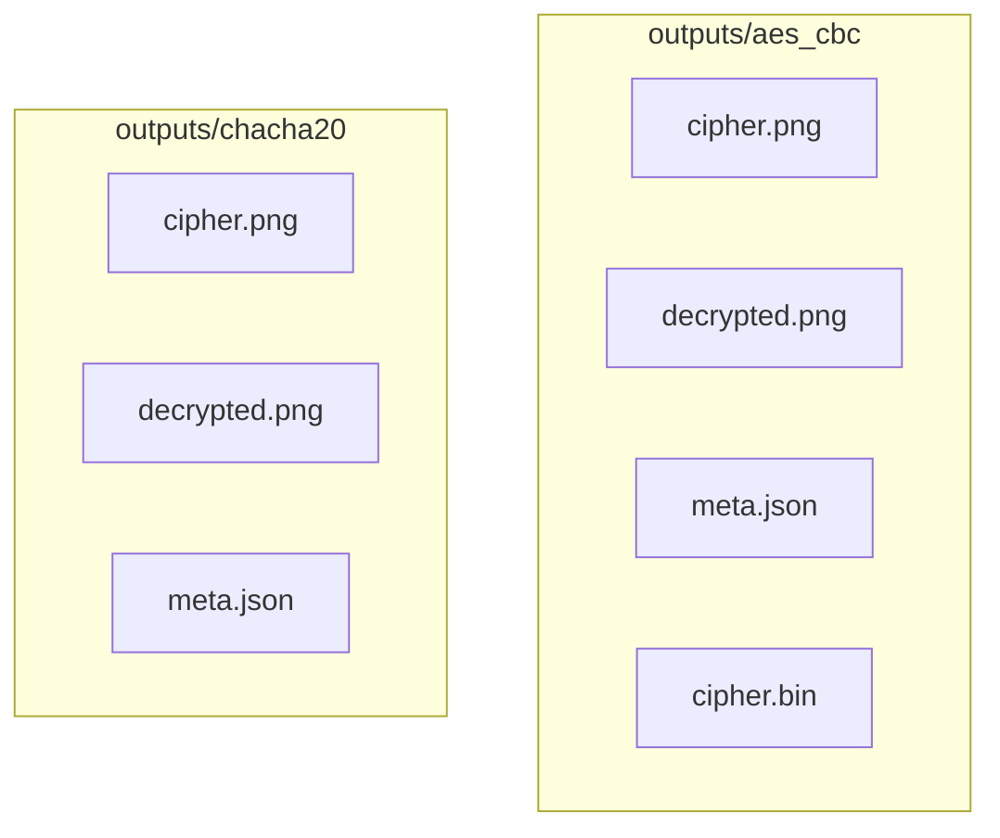

# Analisis Enkripsi Citra: AES-CBC vs ChaCha20


Toolkit penelitian kecil untuk membandingkan AES-CBC dan ChaCha20 pada citra digital. Mencakup metrik kualitatif (MSE, PSNR, SSIM, koefisien korelasi), metrik diferensial (NPCR, UACI, korelasi piksel bersebelahan), serta pengukuran waktu. Tersedia mode CLI dan GUI.

## Fitur
- Enkripsi dan dekripsi citra menggunakan AES-CBC dan ChaCha20.
- Perhitungan metrik:
  - Kualitatif: MSE, PSNR, SSIM, Pearson correlation (CC).
  - Diferensial: NPCR, UACI; korelasi piksel bersebelahan H/V/D.
- Pengukuran efisiensi: average time berdasarkan jumlah pengulangan.
- Penyimpanan artefak: cipher image, decrypted image, metadata (IV/nonce, salt), dan ciphertext biner.
- GUI dengan pratinjau, tabel metrik, log proses, dan histogram distribusi intensitas.

## Ringkasan Visual

Diagram alur kerja end-to-end (Mermaid):

```mermaid
flowchart LR
  A[Input Image] --> KAES[AES-CBC Encrypt]
  A --> KCH[ChaCha20 Encrypt]

  KAES --> CAES[Cipher Image (AES)]
  KCH --> CCH[Cipher Image (ChaCha20)]

  CAES --> MAES[MSE · PSNR · SSIM · CC]
  CCH --> MCH[MSE · PSNR · SSIM · CC]

  A --> D[NPCR · UACI · Adj H/V/D]

  MAES --> CMP[Perbandingan]
  MCH --> CMP
  D --> CMP

  CMP --> OUT[Outputs + Metadata]
  CMP --> GUI[GUI: Preview + Histogram]
  CMP --> CLI[CLI: Analisis via argumen]
```

Struktur artefak output:



## Persyaratan
- Python 3.10+
- Dependensi pada `requirements.txt` (termasuk `opencv-python` untuk SSIM dan `matplotlib` untuk histogram).
- Tkinter (sudah ada di Python untuk Windows; di Linux perlu paket sistem).

## Instalasi
Windows (Terminal VS Code):
```bash
py -m pip install -r requirements.txt
```
Linux/macOS:
```bash
python -m pip install -r requirements.txt
```

## Penggunaan (CLI)
Jalankan komparasi end-to-end pada satu citra:
```bash
python main.py --image path/to/image.png --password rahasia --output-dir outputs --repeats 5
```
Argumen:
- `--image`: path citra input (PNG/JPG/TIFF/BMP).
- `--password`: passphrase untuk derivasi kunci.
- `--output-dir`: folder output.
- `--repeats`: jumlah pengulangan untuk rata-rata waktu.

Artefak disimpan di:
- `outputs/aes_cbc/` dan `outputs/chacha20/` (cipher, decrypted, metadata, `cipher.bin` bila relevan).

## Penggunaan (GUI)
Luncurkan GUI untuk menjalankan analisis secara interaktif:
```bash
python -m gui.app
```
Di GUI terdapat:
- Memilih citra dan folder output.
- Memilih algoritma (AES-CBC atau ChaCha20).
- Mengatur password dan jumlah pengulangan.
- Melihat pratinjau (Original, Encrypted, Encrypted2, Decrypted), tabel metrik, log, dan histogram.


## Penjelasan Metrik
- MSE: rata-rata kuadrat error antar-citra.
- PSNR (dB): rasio puncak sinyal terhadap noise.
- SSIM: kesamaan struktur (menggunakan Gaussian blur via OpenCV).
- CC: koefisien korelasi Pearson.
- NPCR (%): persentase perubahan piksel pada cipher saat satu piksel plaintext diubah.
- UACI (%): rata-rata perubahan intensitas pada kondisi perubahan satu piksel plaintext.
- Adjacent correlation (H/V/D): korelasi antar piksel bertetangga pada cipher.
- Avg Time (s): waktu rata-rata enkripsi dari `--repeats`.

Reproducibility: seed acak dipatok (`random.seed(42)`).

## Struktur Proyek
```
main.py
aes_cbc/       # Derivasi kunci, encrypt/decrypt AES-CBC
chacha20/      # Key schedule, encrypt/decrypt ChaCha20
kualitatif/    # MSE, PSNR, SSIM, korelasi
diferensial/   # NPCR, UACI
efisiensi/     # Pengukuran waktu
gui/           # GUI berbasis Tkinter + Matplotlib
```

## Catatan Teknis
- AES-CBC memakai PKCS7 padding; untuk visualisasi/metrik, ciphertext dapat dipotong ke ukuran citra, sedangkan dekripsi memakai ciphertext penuh yang disimpan pada `cipher.bin`.
- ChaCha20 (stream cipher) mempertahankan panjang data sehingga pemetaan cipher ke citra 1:1.
- Waktu proses meningkat untuk citra besar dan pengulangan tinggi.

## Troubleshooting
- SSIM error: pastikan `opencv-python` terinstal.
- Masalah Tkinter di Linux: `sudo apt-get install python3-tk`.
- Tidak bisa menulis output: cek izin tulis pada `--output-dir`.

## Sitasi
Gunakan sitasi repositori ini pada karya ilmiah dan sebutkan konfigurasi (ukuran citra, jumlah pengulangan, parameter algoritma).